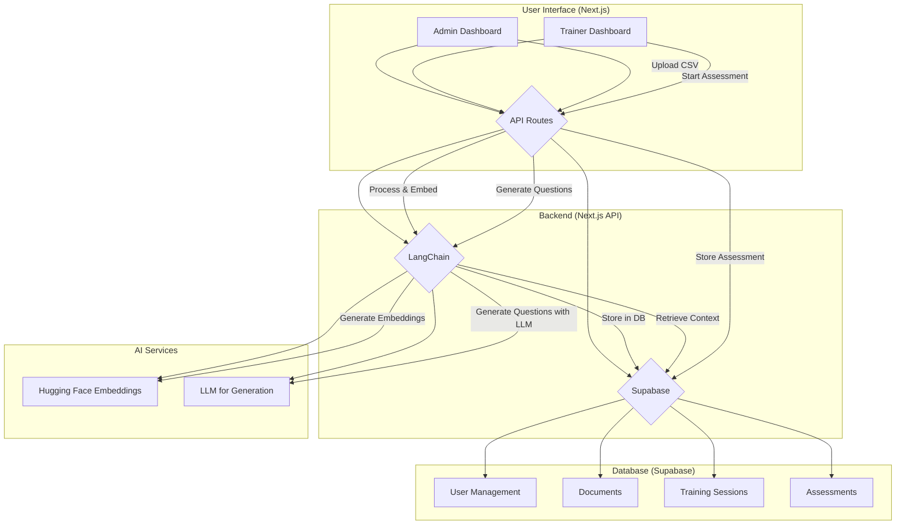

# Architecture

## System Architecture Overview

The Echo Assistant Training platform is built on a modern, serverless architecture that leverages Next.js for the frontend and API, Supabase for the backend and database, and a combination of LangChain and Hugging Face for its AI capabilities. The system is designed to be scalable, maintainable, and efficient.

## Architectural Diagram

## Component Descriptions

- **User Interface (Next.js):** The frontend of the application, built with React and Next.js. It provides role-based dashboards for admins and trainers.
- **API Routes (Next.js):** The backend logic of the application, built with Next.js API routes. These routes handle requests from the frontend, interact with the database, and orchestrate AI-related tasks.
- **Supabase:** The backend-as-a-service platform that provides the database, authentication, and storage.
- **LangChain:** The AI orchestration library that connects the different AI components, such as the language model and the retrieval chain.
- **Hugging Face Embeddings:** The service used to generate vector embeddings for the documents in the knowledge base.
- **LLM for Generation:** A large language model (not specified in the codebase, but implied) is used for generating assessment questions and providing feedback.

## Data Flow

1.  **Document Upload:** An admin uploads a CSV file through the admin dashboard.
2.  **Processing and Embedding:** The backend API receives the file, processes the text, and uses LangChain to generate embeddings for the content using a Hugging Face model.
3.  **Storage:** The processed content and its embeddings are stored in the Supabase database.
4.  **Assessment Generation:** A trainer initiates an assessment.
5.  **Question Generation:** The backend API uses LangChain to retrieve relevant context from the database and generate assessment questions using a large language model.
6.  **Assessment Storage:** The generated assessment is stored in the Supabase database.
7.  **Answering and Feedback:** The user answers the questions, and the system provides feedback based on the correctness of the answers.
